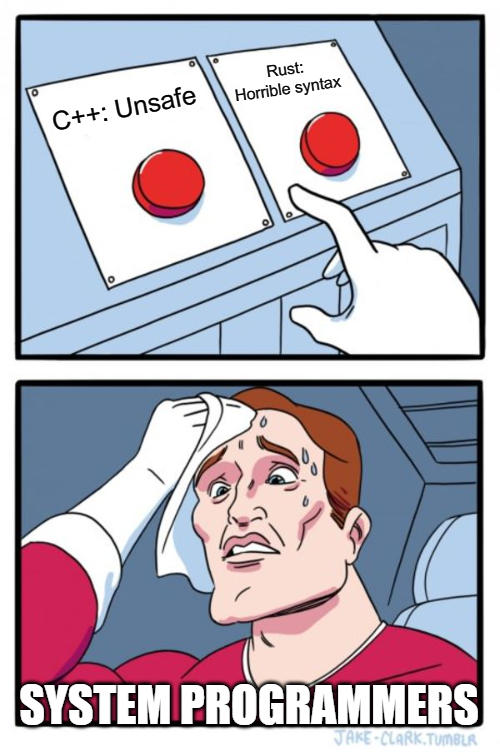

So I have decided to start this blog up again to track my (side) development effort. I have been working on a few things lately and I think it would be good to document them here.

## I'm learning Rust!

I'm interested in Rust as I predict it will overtake C++ in popularity within the next 2-3 years if the trends in the above graph from [Stackoverflow Trends](https://insights.stackoverflow.com/trends?tags=c%2B%2B%2Crust) continues. Rust is growing in popularity exponentially and C++ seems to have a linear decline.

The reasons for this, I think, are many.

Rust has a built in package manager which also handles compilation and makes the developer experience easy, and convenient always triumphs difficult. This is a huge boon to productivity and also a huge breath of fresh air after C++. It took me about 6 weeks to get started with C++ (finding a package manager amongst many, trying to understand CMake). I think what is happening is young^[The average age of C++ devs is over 40 these days, see [Q2 and Q3](https://isocpp.org/files/papers/CppDevSurvey-2022-summary.pdf), also Q6 notes the major pain point is "Managing libraries my application depends on
"], C++ developers are trying Rust and then being won over by this after struggling through C++.

Rust has a lot of modern language features like, what JavaScript would call "promises". And they are used consistently and everywhere within the standard lib. Some C++ people say that the syntax is horrible, but its just different and I find it more concise and not littered with as much noise as C++.

## Current problems with Rust

No native linear algebra libraries or [Scientific/High-Performance Computing](https://www.reddit.com/r/rust/comments/smdl3m/rust_and_scientifichighperformance_computing/) (HPC). It does have bindings for OpenBLAS a C++ lib but its apparently a nightmare to get working cross platform. This holds it back from deep learning and general data science which both rely heavily on matrix operations.

But its still early days and I think these issues will be address in time.